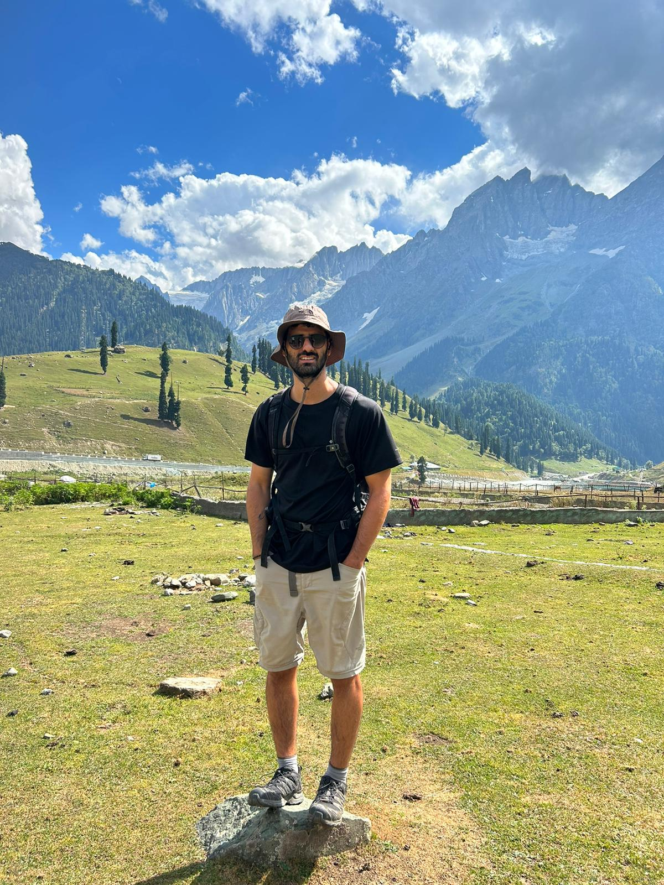

# OmerSapir.github.io

* Hello! I'm Omer Sapir, a master's student at the Weizmann Institute, in the Department of Earth and Planetary Sciences.
* Currently on a rotation at [Prof. Yinon Rudich lab](https://www.weizmann.ac.il/EPS/Rudich/home).

* Interested in Plants, Agriculture and Atmosphere

* Loves to climb and travel!

  

Link to my solutions repository in Python course : [Python-course-assignments](https://github.com/OmerSapir/Python-course-assignments)

Some of my class mates:

[Maher Salhab](https://mahers7.github.io/)

[Roi Siegelman](https://roisiegelman.github.io/)

[Noy Ravensary](https://noyravensary.github.io/)
